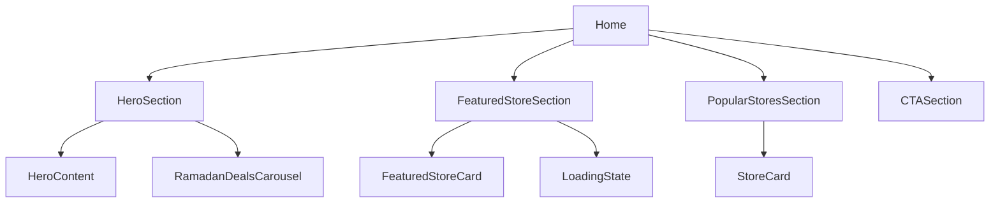

# Home Component Breakdown Plan

## Overview
This plan outlines the strategy for breaking down the large `Home.tsx` file into smaller, more manageable components while maintaining existing functionality and animations.

## Component Structure



## Component Breakdown

### 1. Custom Hooks
- **useInView.ts**
  - Extract existing intersection observer logic
  - Maintain current functionality for animation triggers
- **useHomeAnimations.ts**
  - Manage animation states
  - Handle animation timing and delays
  - Store common animation styles

### 2. Components

#### HeroSection/
- **HeroSection.tsx**: Main hero container
  - Background image handling
  - Container layout
- **HeroContent.tsx**: Hero text and CTA
  - Title animations
  - Arabic text typewriter effect
- **RamadanDealsCarousel.tsx**
  - Deals card display
  - Horizontal scrolling
  - Animation handling

#### FeaturedStoreSection/
- **FeaturedStoreSection.tsx**
  - Section container
  - Loading state management
- **FeaturedStoreCard.tsx**
  - Store information display
  - Image and content layout
  - Animation handling
- **LoadingState.tsx**
  - Loading placeholder

#### PopularStoresSection/
- **PopularStoresSection.tsx**
  - Grid layout
  - Section container
- **StoreCard.tsx**
  - Individual store display
  - Hover effects
  - Animation timing

#### CTASection/
- **CTASection.tsx**
  - Call to action content
  - Animation handling

### 3. Styles
- **animations.css**
  ```css
  /* Common animations */
  @keyframes fadeIn {...}
  @keyframes typewriter {...}
  @keyframes blink {...}
  ```
- **heroStyles.css**
  ```css
  /* Hero-specific styles */
  .hero-background {...}
  .hero-content {...}
  .typewriter {...}
  ```

## Component Props

```typescript
interface HeroSectionProps {
  animationsReady: boolean;
}

interface FeaturedStoreCardProps {
  store: Store;
  isInView: boolean;
  animationsReady: boolean;
}

interface StoreCardProps {
  store: Store;
  delay: number;
  isInView: boolean;
  animationsReady: boolean;
}
```

## File Structure
```
src/
  components/
    home/
      HeroSection/
        index.tsx
        HeroContent.tsx
        RamadanDealsCarousel.tsx
      FeaturedStoreSection/
        index.tsx
        FeaturedStoreCard.tsx
        LoadingState.tsx
      PopularStoresSection/
        index.tsx
        StoreCard.tsx
      CTASection/
        index.tsx
      styles/
        animations.css
        heroStyles.css
  hooks/
    useInView.ts
    useHomeAnimations.ts
  pages/
    Home.tsx
```

## Implementation Strategy

1. **Phase 1: Setup**
   - Create new directories and files
   - Extract hooks into separate files
   - Move animation styles to CSS files

2. **Phase 2: Component Creation**
   - Create individual components
   - Set up props and interfaces
   - Implement component logic

3. **Phase 3: Integration**
   - Update imports in Home.tsx
   - Connect components
   - Test animations and transitions

4. **Phase 4: Testing**
   - Verify all animations work
   - Check responsive behavior
   - Ensure no functionality is lost

## Benefits

- **Improved Maintainability**: Smaller, focused components
- **Better Code Organization**: Logical grouping of related code
- **Enhanced Reusability**: Components can be reused elsewhere
- **Easier Testing**: Components can be tested in isolation
- **Simplified Development**: Easier to understand and modify individual sections

## Next Steps

1. Switch to Code mode for implementation
2. Follow the implementation strategy phases
3. Maintain existing functionality throughout the refactor
4. Test thoroughly after each phase