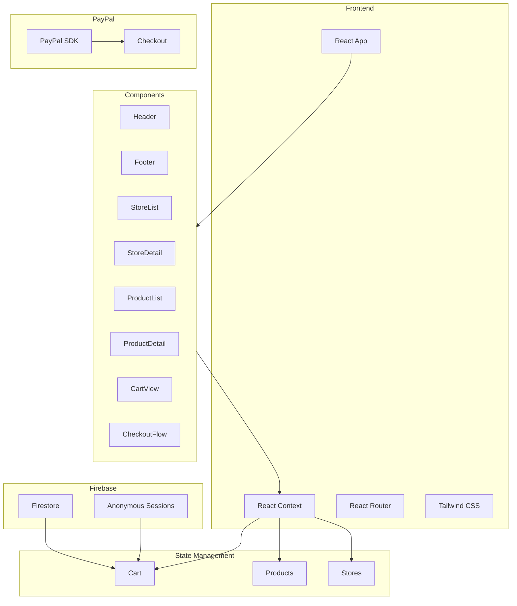

# Technical Implementation Plan

## Architecture Overview



## Implementation Phases

### 1. Project Setup and Configuration (Day 1)
1. Initialize React/Vite project
   - Set up Tailwind CSS
   - Configure React Router
   - Initialize Git repository

2. Create base project structure
   ```
   src/
   ├── components/
   │   ├── layout/
   │   ├── stores/
   │   ├── products/
   │   ├── cart/
   │   └── checkout/
   ├── context/
   ├── data/
   ├── hooks/
   ├── pages/
   ├── styles/
   └── utils/
   ```

### 2. Data Layer Implementation (Day 1-2)
1. Create static data structures
   - Store data in `data/stores.js`
   - Product data in `data/products.js`

2. Implement Context providers
   - StoreContext for store data
   - CartContext for cart management
   - Create custom hooks for data access

### 3. Core Components Development (Day 2-3)
1. Layout components
   - Responsive header with cart icon
   - Mobile-friendly navigation
   - Footer with essential links

2. Store components
   - Store directory grid
   - Store detail page
   - Product listings

3. Product components
   - Product card component
   - Product detail view
   - Add to cart functionality

### 4. Cart Implementation (Day 3-4)
1. Firebase setup
   - Initialize Firebase project
   - Configure Firestore
   - Set up anonymous authentication

2. Cart functionality
   - Cart context with Firebase persistence
   - Cart item management
   - Cart total calculations

### 5. Checkout Flow (Day 4)
1. PayPal integration
   - Set up PayPal Sandbox
   - Implement PayPal SDK
   - Create checkout component

2. Order processing
   - Cart validation
   - Payment flow
   - Success/failure handling

### 6. Testing and Optimization (Day 5)
1. Comprehensive testing
   - Mobile responsive testing
   - Cart persistence verification
   - Payment flow testing
   - Cross-browser compatibility

2. Performance optimization
   - Image optimization
   - Code splitting
   - Lazy loading implementation

### 7. Deployment Preparation
1. Build configuration
   - Environment variables setup
   - Build optimization
   - Error handling

2. Deployment
   - Platform setup (Vercel/Netlify)
   - Domain configuration
   - Final testing

## Technical Considerations

### State Management
- Use React Context for global state
- Implement custom hooks for state access
- Maintain cart state in Firebase

### Responsive Design
- Mobile-first approach
- Breakpoints: sm(640px), md(768px), lg(1024px), xl(1280px)
- Fluid typography and spacing

### Performance
- Lazy loading for routes
- Image optimization
- Minimal third-party dependencies

### Security
- Anonymous sessions for cart
- Secure Firebase rules
- PayPal SDK best practices

## Success Criteria
1. All core features implemented and functional
2. Mobile-responsive across devices
3. Cart data persists across sessions
4. Successful PayPal payment flow
5. Performance metrics meet targets:
   - First contentful paint < 1.5s
   - Time to interactive < 3.5s
   - Lighthouse score > 90