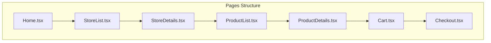

# Pages Implementation Plan

## Page Structure



## Page Files

### 1. Home.tsx
- Landing page for the mall application
- Components:
  - Featured stores section
  - Navigation to store categories
  - Promotional banners
  - Quick access to cart

### 2. StoreList.tsx
- Directory of all mall stores
- Features:
  - Grid layout of store cards
  - Store category filtering
  - Search functionality
  - Responsive grid system

### 3. StoreDetails.tsx
- Individual store page
- Features:
  - Store information and description
  - Store's product categories
  - Featured/Popular products
  - Store-specific promotions

### 4. ProductList.tsx
- Product catalog view
- Features:
  - Product grid/list view toggle
  - Filtering and sorting options
  - Category-based navigation
  - Quick add to cart

### 5. ProductDetails.tsx
- Individual product page
- Features:
  - Product images and gallery
  - Detailed product information
  - Price and availability
  - Add to cart functionality
  - Related products

### 6. Cart.tsx
- Shopping cart management
- Features:
  - Cart items list
  - Quantity adjustments
  - Price calculations
  - Remove items
  - Proceed to checkout button

### 7. Checkout.tsx
- Payment processing
- Features:
  - Order summary
  - PayPal integration
  - Success/failure handling
  - Order confirmation

## Implementation Details

### Common Features Across Pages
- TypeScript for type safety
- Tailwind CSS for responsive design
- React Context for state management
- Error boundary implementation
- Loading states
- Mobile-first approach

### Routing Structure
```typescript
const routes = [
  { path: "/", element: <Home /> },
  { path: "/stores", element: <StoreList /> },
  { path: "/stores/:id", element: <StoreDetails /> },
  { path: "/products", element: <ProductList /> },
  { path: "/products/:id", element: <ProductDetails /> },
  { path: "/cart", element: <Cart /> },
  { path: "/checkout", element: <Checkout /> }
]
```

## Next Steps
1. Create base page files in mall-app/src/pages/
2. Implement routing configuration
3. Set up shared layouts and components
4. Begin page-by-page implementation